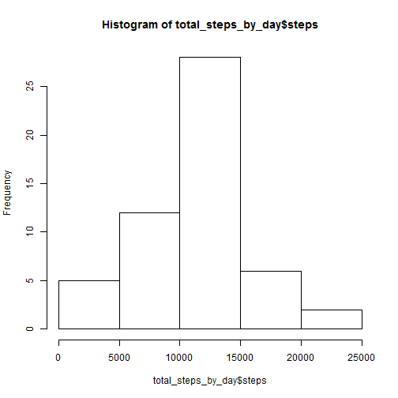
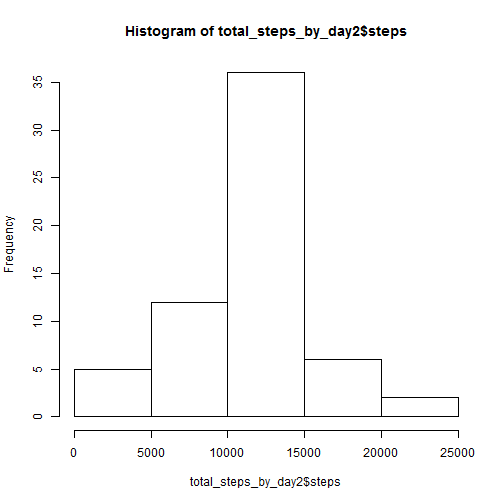
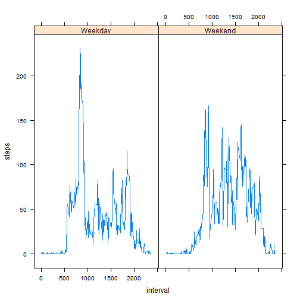

Reproducible Research - Peer Assessment 1
========================================================

This document fulfills the requirements of Peer Assessment 1

The following packages will need to be loaded:


```r
library(knitr)
library(lattice)
```

The first thing to do is download the data and place it in your working directory.  The data can be found at the following website:  https://d396qusza40orc.cloudfront.net/repdata%2Fdata%2Factivity.zip.  Once the .zip file is in your working directory, extract the "activity.csv" file to your working directory.

The following step loads the data:


```r
Activity_Data=read.csv("activity.csv")
```

The following code creates a histogram of the total number of steps taken each day:


```r
total_steps_by_day=aggregate(steps~date,data=Activity_Data,FUN="sum")
hist(total_steps_by_day$steps)
```

 

The following code calculates the mean and median of the total number of steps taken each day:


```r
mean_total_steps_by_day=mean(total_steps_by_day$steps,na.rm=TRUE)
mean_total_steps_by_day
```

```
## [1] 10766
```

```r
median_total_steps_by_day=median(total_steps_by_day$steps,na.rm=TRUE)
median_total_steps_by_day
```

```
## [1] 10765
```

The following code makes a time series plot of the 5-minute interval (x-axis) and the average number of steps taken, averaged acress all days (y-axis)


```r
avg_steps_per_interval=aggregate(steps~interval,data=Activity_Data,FUN="mean")
plot(avg_steps_per_interval,type="l")
```

 

The code that results that answers the following question is given below:  Which 5-minute interval, on average across all the days in the dataset, contains the maximum number of steps?


```r
which.max(avg_steps_per_interval$steps)
```

```
## [1] 104
```

The total number of missing values in the data set is obtained using this code


```r
sum(is.na(Activity_Data))
```

```
## [1] 2304
```

To fill in the missing (NA) values in the dataset, I decided to use the mean for that 5 minute interval (ignoring all NA values).  The following code creates a new dataset that is equal to the original dataset but with the missing data filled in.


```r
Activity_Data2=Activity_Data

  
for(i in 1:nrow(Activity_Data2))
  {
    if (is.na(Activity_Data$steps[i])){
    interval.i=Activity_Data$interval[i]
    Activity_Data2$steps[i]=mean(Activity_Data$steps[Activity_Data$interval==interval.i],na.rm=TRUE)
  }
}
```


The following code creates a histogram of the total number of steps taken each day and calculates the mean and median total number of steps on the new dataset


```r
total_steps_by_day2=aggregate(steps~date,data=Activity_Data2,FUN="sum")
hist(total_steps_by_day2$steps)
```

 

```r
mean_total_steps_by_day2=mean(total_steps_by_day2$steps)
mean_total_steps_by_day2
```

```
## [1] 10766
```

```r
median_total_steps_by_day2=median(total_steps_by_day2$steps)
median_total_steps_by_day2
```

```
## [1] 10766
```

  The following code creates a new factor variable in the 'new' dataset with two levels:  "weekday" and "weekend"
  

```r
  Activity_Data2$Day=weekdays(as.POSIXct(Activity_Data2$date, format="%Y-%m-%d"))
  Activity_Data2$day_type="test"

for (i in 1:nrow(Activity_Data2)){
  if(Activity_Data2$Day[i]=="Saturday"|Activity_Data2$Day[i]=="Sunday"){Activity_Data2$day_type[i]="Weekend"} else {Activity_Data2$day_type[i]="Weekday"}
}
```

The following code calculates the mean steps per interval by 'Weekend' or 'Weekday'


```r
steps_per_interval_day_type=aggregate(steps~interval+day_type,data=Activity_Data2,FUN="mean")
```

The following code createds a panel plot containing a time series plot of the 5 minute interva (x-axis) and the average number of steps taken, averaged across all weekday days or weekend days (y-axis)


```r
xyplot(steps~interval|day_type,data=steps_per_interval_day_type,type='l')
```

 
